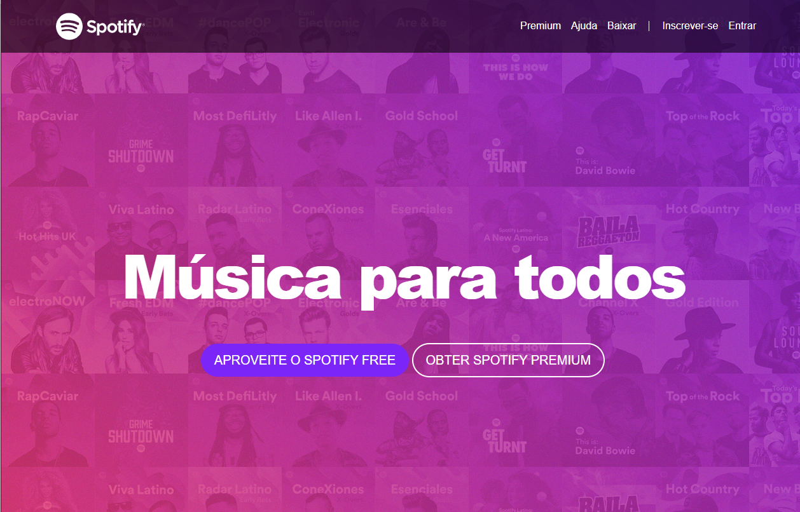
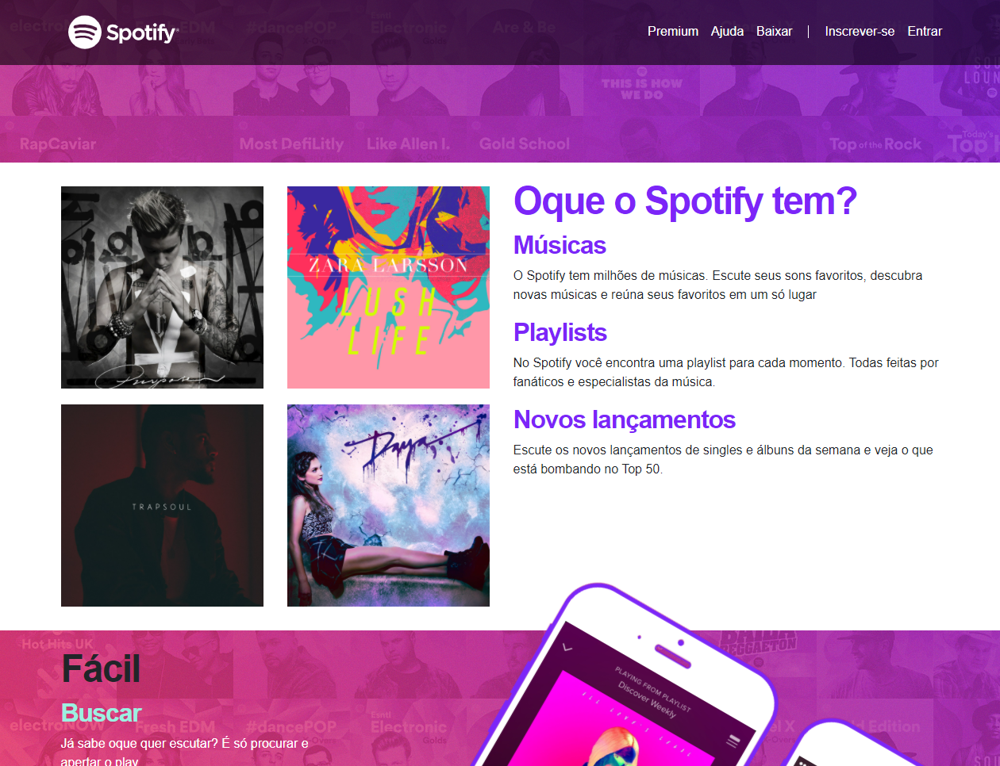
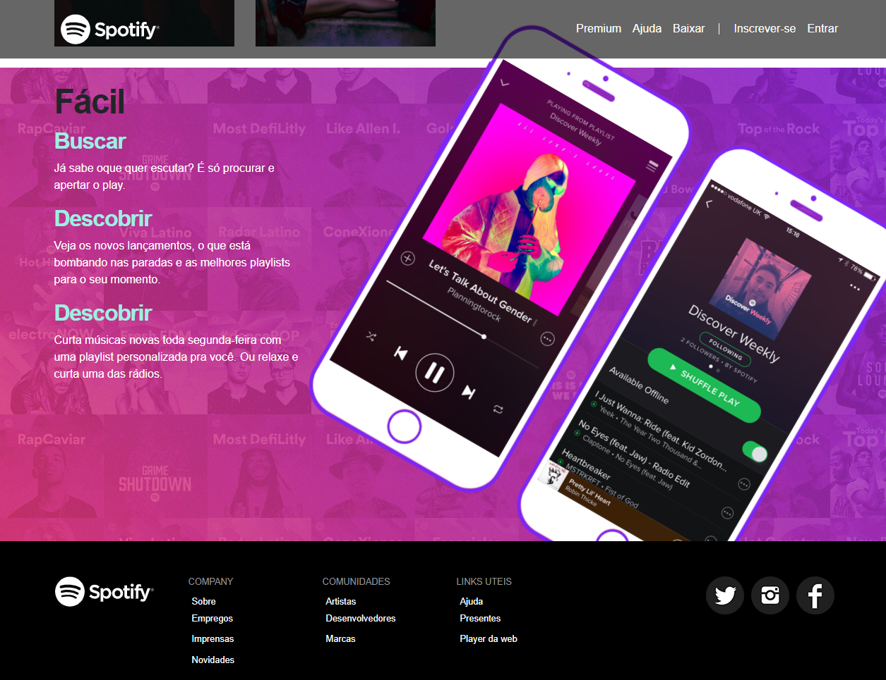
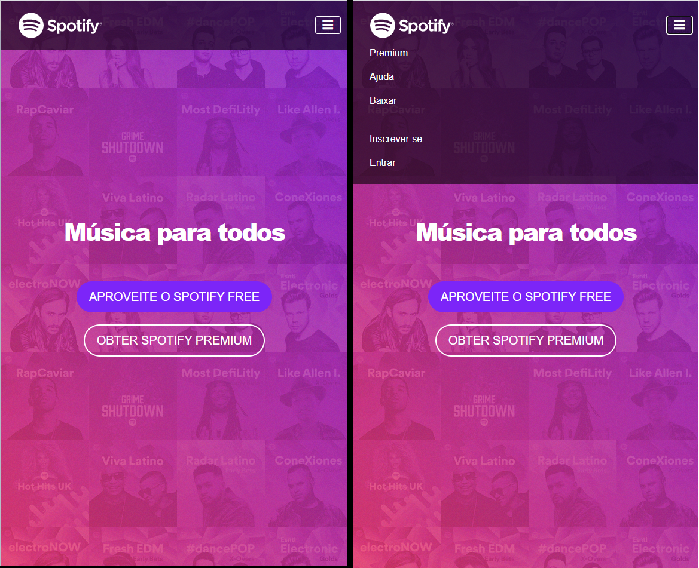
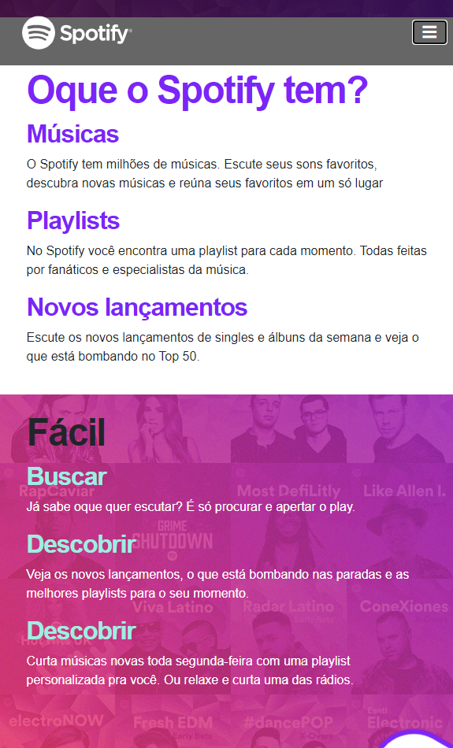

# Spotify
## Página criada utilizando o modelo da página principal do aplicativo Spotify.
<h1 align="center">
  
</h1>

 <a href="#sobre-o-projeto">Sobre</a> •
 <a href="#funcionalidades">Funcionalidades</a> •
 <a href="#layout">Layout</a> • 
 <a href="#tecnologias">Tecnologias</a> • 

<h4 align="center"> 
	 Spotify 🎵 Finalizado
</h4>

## 🎵 Sobre o projeto

🎵 Spotify foi um projeto desenvolvido durante o curso de Desenvolvimento Web ministrado pelo professor Jamilton Damasceno

Esse projeto foi desenvolvido para o estudo de implementação de conceitos básicos e boas práticas adotados na utilização do bootstrap abordando class, trabalhando com sistema
de grid, icones, cards, input group, barra de navegação, botões...
---

## ⚙Funcionalidades

-Basicamente o projeto consiste de apenas uma página principal pois o fim é apenas didático e introdutório no framework Bootstrap:

  Página Index:
  
  Nesta página estava localizada as informações principais referente ao aplicativo, com uma barra de navegação com um botão, sendo essa tela responsiva alterando o menu
  de acordo com tamanho da tela.
  
  <h3>Página visualidada de um desktop:</h3>
  
  
  ---
  
  
  ---
  
  
  ---
  
   
  
  <h3> Página visualizada por um mobile:</h3>
  A página utilizando a resolução de um dispositvo mobile, tende a retirar a imagem para não gerar confusão ao usuário e a alteração do menu.
   
   
  
  
  ---
  
   

## 🎨Layout

O layout foi fornecido pelo professor 
[Jamilton Damasceno](https://www.linkedin.com/in/jamiltondamasceno/).

### 🛠Tecnologias

As seguintes ferramentas foram usadas na construção do projeto:

- [HTML](https://www.w3schools.com/html/default.asp)
- [CSS](https://www.w3schools.com/css/)
- [Bootstrap](https://getbootstrap.com/)
- [VisualStudio](https://visualstudio.microsoft.com/pt-br/)
